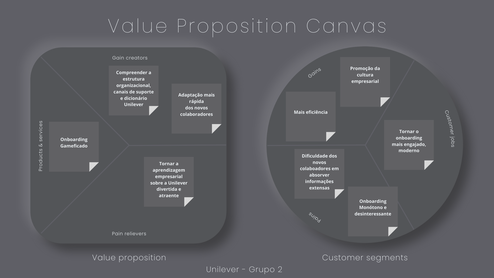
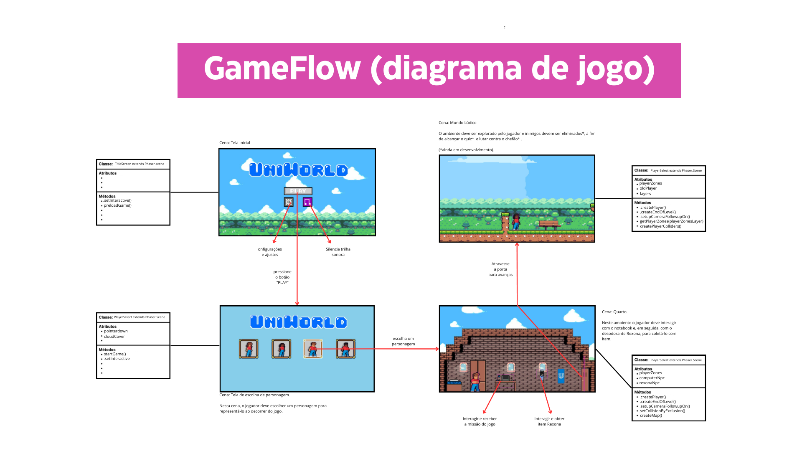

# GDD - Game Design Document - Módulo 1 - Inteli

**_Os trechos em itálico servem apenas como guia para o preenchimento da seção. Por esse motivo, não devem fazer parte da documentação final_**

## Nome do Grupo

#### Nomes dos integrantes do grupo

## Sumário

[1. Introdução](#c1)

[2. Visão Geral do Jogo](#c2)

[3. Game Design](#c3)

[4. Desenvolvimento do jogo](#c4)

[5. Casos de Teste](#c5)

[6. Conclusões e trabalhos futuros](#c6)

[7. Referências](#c7)

[Anexos](#c8)

 

# 1. Introdução (sprints 1 e 4)

## 1.1. Escopo do Projeto

### 1.1.1. Contexto da indústria (sprints 1 e 4)

&nbsp;&nbsp;&nbsp;&nbsp;*Unilever é uma empresa multinacional que possui mais de 400 marcas em mais de 190 países ao redor do mundo e está presente na vida de mais de 3,4 bilhões de pessoas com seus produtos diariamente. Essa indústria é uma das maiores no segmento de bens de consumo no mundo, possuindo cinco vertentes no mercado: alimentação, limpeza, produtos de higiene e produtos de cuidados pessoais. Entre as principais marcas estão: Omo, Dove, Doriana, Kibon, Hellmann 's, Rexona, Knorr-Cica, Lipton, Magnum, Comfort. Contudo, há corporações  multinacionais nesse ramo que competem o pódio, como a Procter & Gamble e a Nestlé.*

### 1.1.2. Análise SWOT (sprints 1 e 4)

&nbsp;&nbsp;&nbsp;&nbsp;*A análise SWOT é relacionada ao parceiro Unilever, a tabela foi feita a fim de realizar uma avaliação ambiental no âmbito estratégico, levando em consideração o contexto da indústria, ocorrências e as características do ambiente interno e externo da Unilever.*

Figura 1 - Análise SWOT

Fonte: Material produzido pelos autores (2024)

### 1.1.3. Descrição da Solução Desenvolvida (sprints 1 e 4)

&nbsp;&nbsp;&nbsp;&nbsp;*A Unilever, apesar de sua posição como empresa líder global, identificou defasagens em seu processo de onboarding, notada na baixa absorção de informações críticas pelos novos colaboradores. A proposta de solução almeja reformular e gamificar o onboarding, incorporando elementos lúdicos para tornar a aprendizagem envolvente e significativa. 
A solução proposta será utilizada como uma ferramenta interativa e dinâmica, apresentando-se na forma de um jogo personalizado destinado a envolver ativamente os novos membros da empresa. Os benefícios almejados incluem aumento na retenção de informações, uma compreensão mais profunda da empresa e um alinhamento eficaz com os valores e objetivos da Unilever. O critério de sucesso será medido através de análises periódicas de desempenho, satisfação e engajamento, visando proporcionar uma transição positiva para o ambiente de trabalho da Unilever.*

### 1.1.4. Proposta de Valor (sprints 1 e 4)

&nbsp;&nbsp;&nbsp;&nbsp;*A proposta de valor descreve aspectos essenciais para criação de valor para o projeto, traçando o objetivo de melhor entender a realidade do parceiro e entregar uma solução alinhada com o que a Unilever espera.*

Figura 2 - Proposta de Valor

Fonte: Material produzido pelos autores (2024)

### 1.1.5. Matriz de Riscos (sprints 1 e 4)

&nbsp;&nbsp;&nbsp;&nbsp;*A matriz de risco demonstra os riscos observados no projeto pela equipe de desenvolvimento, representando ameaças e oportunidades, assim como impactos relevantes sobre o projeto. Em verde, estão indicados percalços que não necessitam de intervenção; em amarelo, pontos que apresentam média probabilidade e demandam certa atenção; e, em vermelho, estão destacados pontos críticos que devem ser evitados.*

Figura 3 - Matriz de Riscos

Fonte: Material produzido pelos autores (2024)

## 1.2. Requisitos do Projeto (sprints 1 e 2)

&nbsp;&nbsp;&nbsp;&nbsp;*Posicione aqui a lista de requisitos levantados para o projeto, sejam pedidos do parceiro ou invenções do grupo. Descreva-os de forma objetiva, de modo que seja possível entender claramente como implementá-los tecnicamente.*

&nbsp;&nbsp;&nbsp;&nbsp;*Aqui, adicionamos alguns pontos que acreditamos que devem estar presentes em nosso projeto. Diante disso, enviamos esta tabela.*
\# | Requisito
--- | ---
1 | Recompensas por responder perguntas relacionadas à Unilever 
2 | Os controles serão: seta cima, esquerda, baixo, direita, Q W e E
3 | HUB de direcionamento para trilhas específicas de Onboarding da Unilever
4 | Apresentação de informações públicas da empresa de forma gamificada
5 | O jogo será em 2D de plataforma
6 | Apresentação das mecânicas do Onboarding
7 | Mostrar o dicionário da Unilever
8 | O personagem perde uma vida toda vez que toca em um inimigo ou em algum projétil inimigo
9 | Mecânica de utilização de poderes
10 | Mundo lúdico - estilo Mario
11 | realização de quiz
12 | Contato com plataformas Unilever (Uniops & degreed)
13 | Mecânica de dash

## 1.3. Público-alvo do Projeto (sprint 2)

Nosso público alvo são pessoas com perfil médio de estagiários na Unilever, na faixa etária média de 24 anos, com formação acadêmica conectada à área de tecnologia

# 2. Visão Geral do Jogo (sprint 2)

## 2.1. Objetivos do Jogo (sprint 2)

&nbsp;&nbsp;&nbsp;&nbsp;*O jogador precisa derrotar inimigos pelo mapa, concluir o quiz e derrotar o chefão da fase, nos dois mundos disponíveis: Mundo Lúdico e Mundo Unilever. Desse modo, o jogador será capaz de concluir o jogo integralmente. Logicamente, conforme solicitado, nenhuma das partes anteriormente citadas será uma barreira para o colaborador completar o processo de integração.*

## 2.2. Características do Jogo (sprint 2)

### 2.2.1. Gênero do Jogo (sprint 2)

&nbsp;&nbsp;&nbsp;&nbsp;*O gênero do jogo é de plataforma e aventura. O gênero de plataforma consiste em movimentar seu personagem através do ambiente no qual jogo acontece. O Gênero de aventura, por sua vez, são jogos nos quais o jogador assume o lugar de protagonista e tem como objetivo explorar o ambiente interativamente concluir quebra-cabeças*  

### 2.2.2. Plataforma do Jogo (sprint 2)

&nbsp;&nbsp;&nbsp;&nbsp;*O jogo é feito para Desktop e será jogado na plataforma Web. Como indicado pelo termo de abertura do projeto e reafirmado pelos parceiros durante as sprints, a opção pela plataforma web desktop está mais alinhada com a proposta e objetivos que delineados para o projeto.*

### 2.2.3. Número de jogadores (sprint 2)

&nbsp;&nbsp;&nbsp;&nbsp;*Devido a indicação do parceiro e, as limitações provenientes das escolhas pela plataforma web e sem ligação com os servidores da empresa, o jogo será individual, por buscando salientar o desenvolvimento individual de cada colaborador.*

### 2.2.4. Títulos semelhantes e inspirações (sprint 2)

&nbsp;&nbsp;&nbsp;&nbsp;*Entre as inspirações para o jogo, pode-se listar Sonic, Mario e Mega Man. As escolhas decorrem do fato de que os jogos citados pertencem aos mesmos gêneros do jogo criado, tendo como base a movimentação em duas dimensões, arte em pixel e a temática de aventura. Além disso, os jogos em questão revolucionaram suas época ao trazer inovação, originalidade e simplicidade, valores igualmente desenvolvidos neste projeto.*

### 2.2.5. Tempo estimado de jogo (sprint 5)

*Ex. O jogo pode ser concluído em 3 horas passando por todas as fases.*

*Ex. cada partida dura até 15 minutos*

# 3. Game Design (sprints 2 e 3)

## 3.1. Enredo do Jogo (sprints 2 e 3)

&nbsp;&nbsp;&nbsp;&nbsp;Você acorda, está se preparando para o primeiro dia na Unilever, mas nota algo diferente, o mundo está imerso em um ambiente mágico, onde a harmonia é mantida pela energia vital da natureza balanceada pela Unilever. No entanto, este equilíbrio está sendo abalado pois as principais marcas foram roubadas por vilões tenebrosos, e agora você precisa batalhar com eles para recuperar e restaurar o equílibro. Os vilões por trás disso tudo são o "Rei da Poluição" e o "Rei do Desmatamento". Estes vilões, acompanhados por seus monstros, espalham o caos, sujeira e a destruição, poluindo e destruindo os belos cenários naturais e ameaçando a vida de todas as criaturas mágicas que habitam esse mundo, incluindo a sua. E agora? Devolva as marcas para Unilver para salvar o mundo?

&nbsp;&nbsp;&nbsp;&nbsp;Cena 0 - Tela de Título
Descrição: Tela simples de título com botão play, configurações e som.

&nbsp;&nbsp;&nbsp;&nbsp;Cena 1 - Seletor de personagem

&nbsp;&nbsp;&nbsp;&nbsp;Tela simples para que o jogador selecione seu personagem.

&nbsp;&nbsp;&nbsp;&nbsp;Cena 2 - Quarto

&nbsp;&nbsp;&nbsp;&nbsp;Descrição: Quarto do personagem com um PC e um Rexona (Power-up) interativo.

&nbsp;&nbsp;&nbsp;&nbsp;O personagem irá acordar em seu aconchegante quarto, tendo como objetivo interagir com o computador. No dispositivo, ele será apresentado ao Microsoft Teams, onde sua diretora o dará a missão de recuperar as marcas e lhe dará uma das marcas que sobraram para ajuda-lo em sua caminhada.

&nbsp;&nbsp;&nbsp;&nbsp;Fala da diretora:

'Diretora: Olá, colaborador, seja bem vindo a Unilever!',
'Diretora: aqui na Unilever utilizamos o Microsoft Teams como principal forma de comunicação remota.',
'Diretora: Vilões tenebrosos roubaram algumas de nossas marcas, e por conta disso, não estamos mais conseguindo manter o equilíbrio da Unilever.',
'Diretora: Iremos te enviar uma das nossas marcas para você conseguir enfrentar os desafios a frente sem nem suar'
'Diretora: Contamos com você, herói, ajude-nos a recuperar nossas marcas e reestruturar a empresa'

&nbsp;&nbsp;&nbsp;&nbsp;Em seguida, o personagem seguirá pela cena e deverá interagir com o Rexona.

&nbsp;&nbsp;&nbsp;&nbsp;Iniciará o diálogo:
 
'Parabéns, você conseguiu o power-up do Super Rexona!',
'Para utilizar seus novos poderes utilize a tecla Q'

&nbsp;&nbsp;&nbsp;&nbsp;Cena 3 - Cenário combate 1

&nbsp;&nbsp;&nbsp;&nbsp;O personagem sai do quarto e se depara com um mundo lúdico estilo Super Mario. Para avançar na fase, ele deve seguir para direita e derrotar os inimigos com o poder do Rexona. Ao longo da fase, estarão espalhados 2 NPCs que são obrigatórios para prosseguir na fase. Quando o jogador interagir com eles, terá acesso aos links disponibilizados pela Unilever, e só poderá prosseguir no jogo após clicar nos links oferecidos pelos NPCs. No caminho, também estarão disponíveis 3 pontos de interação não obrigatórios (que serão lixos a serem coletados), ao interagir com eles, aparecerá no topo da tela quantos desses você interagiu, (exemplo: ⅓), caso o personagem interaja com todos eles ocorrerá o seguinte diálogo com a diretora:

Uau! Você foi além e recolheu todo o lixo que encontrou pelo caminho. Receba uma bonificação pelo seu ato de valor!
(nesse momento o personagem receberá uma bonificação, uma vida extra).

&nbsp;&nbsp;&nbsp;&nbsp;Perto do fim da fase, haverá um quiz no computador, que também servirá como checkpoint, caso ele acerte o quiz, receberá um aumento de poder, caso perca, nada acontecerá, e ele poderá prosseguir na fase e enfrentar o boss “Rei da poluição”. Caso ele perca para o rei, poderá retornar a fase onde está o quiz, e poderá refazê-lo caso não tenha acertado da última vez, assim, enfrentará novamente o boss quantas vezes forem necessárias. Caso ganhe do boss, ele deverá soltar um item um “Omo”, ao personagem interagir com o item, ele se tornará o “SUPER OMO”, e o diretora aparecerá novamente com o seguinte diálogo:

Nossa! Sempre soube que você era capaz. Você derrotou o rei da poluição, mas ainda há muito por vir. Continue no caminho para Unilever e você encontrará o rei do desmatamento, com seus novos poderes, você será capaz de derrotá-lo.

&nbsp;&nbsp;&nbsp;&nbsp;Para finalizar a fase terá um botão na janela de diálogo com a diretora escrito “Seguir para próxima fase”

&nbsp;&nbsp;&nbsp;&nbsp;Cena 4 - Exploração urbana combate 2

&nbsp;&nbsp;&nbsp;&nbsp;Agora o personagem se encotra em um cenário urbano e acabado. No início, a assistente de jogo do personagem o ensinará como utilizar a mecânica “dash”. Para avançar na fase, ele deve seguir para direita e derrotar os inimigos com o poder do OMO, utilizando todas as mecânicas de movimentação necessárias. Ao longo da fase, estarão espalhados 2 NPCs que são obrigatórios para prosseguir na fase. Quando o jogador interagir com eles, terá acesso aos links disponibilizados pela Unilever, e só poderá prosseguir no jogo após clicar nos links oferecidos pelos NPCs. Ao longo da fase também estarão disponíveis 3 pontos de interação não obrigatórios (que serão árvores a serem plantadas), ao interagir com eles, aparecerá no topo da tela quantos desses você interagiu (exemplo: ⅓), caso o personagem interaja com todos, ocorrerá o seguinte diálogo com a diretora:

Uau! Você foi além e plantou árvores pelo caminho. Receba uma bonificação pelo seu ato de valor!
(nesse momento o personagem receberá uma bonificação, de preferência uma vida extra).

&nbsp;&nbsp;&nbsp;&nbsp;Perto do fim da fase, haverá um quiz que o NPC te fornecerá, que também servirá como checkpoint, caso o jogador acerte o quiz, receberá um aumento de poder. Caso erre, nada acontecerá, e ele poderá prosseguir na fase e enfrentar o boss “Rei do desmatamento”. Caso ele perca pro rei, irá retornar a seção onde está o quiz, e poderá refazê-lo caso não tenha acertado da última vez, assim, enfrentará novamente o boss quantas vezes forem necessárias. Caso ele ganhe do chefe, o boss deverá soltar o item “Kibon” e a chave de acesso a Unilever, ao interagir com o item, o personagem ganhará novos poderes, Se tornando o "Super Kibon" e então deverá se iniciar o diálogo:

&nbsp;&nbsp;&nbsp;&nbsp;Eu sempre soube que você era capaz! Agora com seus novos poderes, vá direto para Unilever para consertarmos o planeta!
Para finalizar a fase basta interagir com uma placa desenhada no cenário escrito “U”, e assim, aparecerá uma janela escrita “Deseja utilizar a chave de entrada para Unilever?”, quando o funcionário apertar o botão “Sim”, a próxima fase se iniciará.

&nbsp;&nbsp;&nbsp;&nbsp;Cena 5 - Dentro da Unilever (cena final)

&nbsp;&nbsp;&nbsp;&nbsp;O personagem se encontra agora na Unilever.  No início, a assistente de jogo do personagem o ensinará como utilizar a mecânica “super dash”. Com esse power up da Kibon, o personagem deverá utilizar o super dash, e assim, avançar na fase, ele deve seguir para direita e avançar pelo terreno um pouco mais difícil agora.  Ao longo da fase, não terão NPCs, a fim de instigar dúvidas no jogador. Também não terão pontos de interação pelo mapa.

&nbsp;&nbsp;&nbsp;&nbsp;Perto do fim da fase, o jogador encontrará a diretora. Ao conversar com o NPC se iniciará o seguinte diálogo:

PARABÉNS! Você conseguiu derrotar todos os vilões e recuperar as nossas tão queridas marcas. Graças a você, conseguimos voltar a nossa força total e recuperar o equilíbrio do mundo. Seja bem vindo, herói, faça parte da nossa família Unilever.

&nbsp;&nbsp;&nbsp;&nbsp;A fase acaba com o personagem seguindo pelo cenário e encontrando um computador para interação no final do mapa. Neste computador quando ele interagir, reaparecerá a cena 0.

## 3.2. Personagens (sprints 2 e 3)

### 3.2.1. Controláveis

&nbsp;&nbsp;&nbsp;&nbsp;*O jogo contará apenas com 1 personagem controlável que terá variações de gênero e etnia. O personagem não tem nome nem rosto, ele deverá representar o funcionário da Unilever, portanto possui forma humana e tem como objetivo seguir as instruções dadas ao longo do enredo da história. Ao longo do game, o personagem receberá power-ups, que irão alterar suas roupas.*

### 3.2.2. Non-Playable Characters (NPC)

&nbsp;&nbsp;&nbsp;&nbsp;*O jogo contará com diversos NPCs pacíficos espalhados pelo mapa, que não terão nome, de acordo com o enredo serão apenas pessoas dispostas a ajudar o player. Ao interagir com os NPCs pacíficos, o jogador terá acesso a links e materiais sobre a Unilever. Ao longo do mapa terão 4 NPCs diferentes, com design parecido com o a seguir.*

### 3.2.3. Diversidade e Representatividade dos Personagens

&nbsp;&nbsp;&nbsp;&nbsp;*O jogo abordará a diversidade e representatividade dos personagens por meio de um sistema de seleção inicial no game, cujo o jogador poderá escolher o sprite de personagem com o qual ele se identifica. Para figuras com semblantes, terão 3 opções de etnia. Para semblantes femininos, também haverá 3 opções de etnia. Além disso, os personagens não jogavéis ao longo do jogo possuem diversas etnias e origens.
Seguem alguns exemplos:*

## 3.3. Mundo do jogo (sprints 2 e 3)

### 3.3.1. Locações Principais e/ou Mapas (sprints 2 e 3)

&nbsp;&nbsp;&nbsp;&nbsp;*A cena inicial do jogo será no quarto, ambiente no qual é possível encontrar objetos mundanos como uma cama, guarda-roupas, mesa, janelas, um quadro e os itens principais deste ambiente: o desodorante Rexona e um notebook. O personagem irá acordar no ambiente em questão e irá interagir com um notebook que, dentro dele, encontrará informações sobre as plataformas que são utilizadas na empresa. No computador após utilizar a ferramenta do teams, entra numa reunião onde recebe a missão de chegar a Unilever.*

Figura 4 - Ilustração do ambiente Quarto

Fonte: Material produzido pelos autores (2024)

&nbsp;&nbsp;&nbsp;&nbsp;*O segundo ambiente...*

*Esse ambiente se encontra no Mundo Lúdico, onde o Player terá a primeira gameplay de fato do jogo, nessa fase, é possivel encontrar objetos de decoração relacionados à Unilever, será possível batalhar contra inimigos e no final da fase um "chefão". O objetivo do Player nessa fase é interagir com o NPC que disponibiliza dos Links de aprendizado da Unilever e depois interagir com o objeto de Quiz que lhe dará ou não o powerUp baseado no resultado. Depois de derrotar o primeiro chefe, pode seguir para o terceiro ambiente*

Figura 5 - Ilustração do Mundo Lúdico

Fonte: Material produzido pelos autores (2024)
Figura 6 - Ilustração NPC do Hub de Links

Fonte: Material produzido pelos autores (2024)
Figura 7 - Ilustração do Hub de Links

Fonte: Material produzido pelos autores (2024)

### 3.3.2. Navegação pelo mundo (sprints 2 e 3)

&nbsp;&nbsp;&nbsp;&nbsp;*O personagem controlável tem a possibilidade de mover-se no eixo X, fazendo com que seja intuitivo a linearidade de avanço da história, cujo seguir para direita indica avanço. Ademais, o personagem tem a possibilidade de se deslocar no eixo Y, mas retornando sempre para o ponto inicial neste eixo após algum tempo, simulando uma mecânica de pulo. Além disso, as fases são desbloqueadas conforme conclusão dos objetivos de cada fase, que consiste em, até o momento, completar um quiz ou derrotar determinado inimigo. A progressão em questão acontece naturalmente, ao decorrer do jogo e sem grandes dificuldades para o jogador.*

### 3.3.3. Condições climáticas e temporais (sprints 2 e 3)

&nbsp;&nbsp;&nbsp;&nbsp;*O jogo não apresentará mudanças climáticas em cenários ao longo da experiência do usuário. O enredo e cenários foram projetados com um tempo ensolarado que permeia do início ao fim do jogo Além disso, a passagem do tempo não possui influência no mundo do jogo, devido a pedido do próprio parceiro sobre a criação de poucas ou nenhuma limitaçõe para conclusão do onboarding.*

### 3.3.4. Concept Art (sprint 2)

*Inclua imagens de Concept Art do jogo que ainda não foram demonstradas em outras seções deste documento. Para cada imagem, coloque legendas, como no exemplo abaixo.*

Figura 8 - Arte Conceitual da Cena 2

Fonte: Material produzido pelos autores (2024)

Figura 1: Descrição dos objetos dispostos na segunda cena, como plataformas, NPCS e coletáveis.

### 3.3.5. Trilha sonora (sprint 3)

*Descreva a trilha sonora do jogo, indicando quais músicas serão utilizadas no mundo e nas fases. Utilize listas ou tabelas para organizar esta seção. Caso utilize material de terceiros em licença Creative Commons, não deixe de citar os autores/fontes.*

*Exemplo de tabela*
\# | titulo | ocorrência | autoria
--- | --- | --- | ---
1 | Pure Imaginaion | tela de início | Avery Mavery
2 | tema de combate | Level 1 (Quarto do Personagem) | Hans Zimmer
3 | tema de combate | Level 2 (Mundo Lúdico) | Hans Zimmer

Licensas: https://mixkit.co/license/#sfxFree
## 3.4. Inventário e Bestiário (sprint 3)

### 3.4.1. Inventário

*\<opcional\> Caso seu jogo utilize itens ou poderes para os personagens obterem, descreva-os aqui, indicando títulos, imagens, meios de obtenção e funções no jogo. Utilize listas ou tabelas para organizar esta seção. Caso utilize material de terceiros em licença Creative Commons, não deixe de citar os autores/fontes.* 

*Exemplo de tabela*
\# | item |  | como obter | função | efeito sonoro
--- | --- | --- | --- | --- | ---
1 | rexona |  | ele pode ser obtido no início da cena 3 | aumentar a força do personagem | não tem
2 | omo |  |  | ele pode ser obtido no final da cena 3 | aumentar a força do personagem | não tem
3 | kibon |  | ele pode ser obtido no final da cena 4 | aumentar a velocidade do personagem | não tem
4 | coração |  | ele pode ser obtido após acertar um quiz | representa a quantidade de vidas do personagem | não tem

### 3.4.2. Bestiário

*\<opcional\> Caso seu jogo tenha inimigos, descreva-os aqui, indicando nomes, imagens, momentos de aparição, funções e impactos no jogo. Utilize listas ou tabelas para organizar esta seção. Caso utilize material de terceiros em licença Creative Commons, não deixe de citar os autores/fontes.* 

*Exemplo de tabela*
\# | inimigo |  | ocorrências | função | impacto | efeito sonoro
--- | --- | --- | --- | --- | --- | ---
1 | fumaçinha |  |  a partir da fase 1 | ataca o personagem vindo pelo chão em sua direção, com velocidade constante, atirando parafusos | se encostar no inimigo ou no parafuso arremessado, o personagem perde 1 ponto de vida | sons de tiros e engrenagens girando
2 | robô voador |  | a partir da fase 2 | ataca o personagem vindo pelo ar, fazendo movimento em 'V' quando se aproxima | se encostar, o personagem perde 3 pontos de vida | som de hélice
3 | ... 

## 3.5. Gameflow (Diagrama de cenas) (sprint 2)

*Posicione aqui seu "storyboard de programação" - o diagrama de cenas do jogo. Indique, por exemplo, como o jogo começa, quais opções o jogador tem, como ele avança nas fases, quais as condições de 'game over', como o jogo reinicia. Seu diagrama deve representar as classes, atributos e métodos usados no jogo.*

Figura 6 - Diagrama de Cenas

Fonte: Material produzido pelos autores (2024)

## 3.6. Regras do jogo (sprint 3)

*Descreva aqui as regras do seu jogo: objetivos/desafios, meios para se conseguir alcançar*

*Ex. O jogador deve pilotar o carro e conseguir terminar a corrida dentro de um minuto sem bater em nenhum obstáculo.*

*Ex. O jogador deve concluir a fase, derrotando os inimigos e coletando os pedaços do logo da Unilever. Além disso, no final da fase, deve derrotar um boss e responder um quiz. Caso ele acerte o quiz, ele terá uma bonificação em alguma habilidade (força, alcance, velocidade...). Além disso, caso o jogador consiga formar a logo da Unilever espalhada pelo mapa, reunindo os pedaços, ele ganha uma vida extra. O jogador deve concluir a fase dentro do tempo, para obter uma estrela. Se além disso ele coletar todas as moedas, ganha mais uma estrela. E se além disso ele coletar os três medalhões espalhados, ganha mais uma estrela, totalizando três. Ao final do jogo, obtendo três estrelas em todas as fases, desbloqueia o mundo secreto.*  

## 3.7. Mecânicas do jogo (sprint 3)

&nbsp;&nbsp;&nbsp;&nbsp;No nosso jogo de plataforma 2D para computador, o jogador pode utilizar as teclas de seta do teclado para usar as mecânicas de se locomover e pular. Além disso caso o jogador pressione 2 vezes seguidas as teclas para cima o personagem irá dar um pulo duplo. Outra tecla importante para a jogabilidade proposta no nosso game é a tecla E, que usa a mecânica de interação, caso apertada ao lado de um NPC ou power-up por exemplo.

# 4. Desenvolvimento do Jogo

## 4.1. Desenvolvimento preliminar do jogo (sprint 1)

&nbsp;&nbsp;&nbsp;&nbsp;*O processo inicial de desenvolvimento se deu por meio da entrega do MPV, implementando a existência de um cenário e  a movimentação básica do personagem, como ilustra a figura 1. Além disso diálogos com NPCs (Personagem não Jogável) também foram incluídos, contemplados na figura 2.*

Figura 1 - Fase Inicial - Mundo Lúdico

Fonte: Material produzido pelos autores (2024)

Figura 2 - Fase Inicial - Interação com NPC

Fonte: Material produzido pelos autores (2024)

## 4.2. Desenvolvimento básico do jogo (sprint 2)

&nbsp;&nbsp;&nbsp;&nbsp;*Ao longo do desenvolvimento da versão básica do jogo, o grupo foi capaz de incluir novas mecânicas, novo design e mais fases. A figura 1 abaixo ilustra a tela de início funcional do jogo, que permite o acesso às demais funcionalidades. Em seguida, a figura 2 apresenta a tela de seleção de personagem criada, possibilitando maior diversidade ao representar o colaborador. A figura 3 ilustra o ambiente do Quarto, que contém as novas interações com itens e NPCs (Personagens Não-Jogáveis), como demonstradas na figura 4. Por fim, a figura 5 ilustra o novo cenário ao ar livre chamado Mundo Lúdico, que será intermediário ao longo do jogo.

Figura 1 - Tela de Início

Fonte: Material produzido pelos autores (2024)

Figura 2 - Seleção de Personagem

Fonte: Material produzido pelos autores (2024)

Figura 3 - Fase 1 - Quarto

Fonte: Material produzido pelos autores (2024)

Figura 4 - Fase 1 - Interação com NPC dentro do Quarto

Fonte: Material produzido pelos autores (2024)

Figura 5 - Fase 2 - Mundo Lúdico

Fonte: Material produzido pelos autores (2024)

## 4.3. Desenvolvimento intermediário do jogo (sprint 3)

*Descreva e ilustre aqui o desenvolvimento da versão intermediária do jogo, explicando brevemente o que foi entregue em termos de código e jogo. Utilize prints de tela para ilustrar. Indique as eventuais dificuldades e próximos passos.*

## 4.4. Desenvolvimento final do MVP (sprint 4)

*Descreva e ilustre aqui o desenvolvimento da versão final do jogo, explicando brevemente o que foi entregue em termos de MVP. Utilize prints de tela para ilustrar. Indique as eventuais dificuldades e planos futuros.*

## 4.5. Revisão do MVP (sprint 5)

*Descreva e ilustre aqui o desenvolvimento dos refinamentos e revisões da versão final do jogo, explicando brevemente o que foi entregue em termos de MVP. Utilize prints de tela para ilustrar.*

# 5. Testes (sprint 4)

## 5.1. Casos de Teste

*Descreva nesta seção os casos de teste comuns que podem ser executados a qualquer momento para testar o funcionamento e integração das partes do jogo. Utilize tabelas para facilitar a organização.*

*Exemplo de tabela*
\# | pré-condição do teste | o que ocorre no teste | resultado esperado do teste
--- | --- | --- | --- 
1 | Abrir tela inicial do jogo | Clicar no botão “play” | Iniciar cena 1
2 | Abrir tela inicial do jogo | Clicar no botão “som” | Silenciar som do jogo
3 | Posicionar personagem em frente ao notebook | Apertar tecla de interação com o notebook | Abrir diálogo na plataforma teams
4 | Posicionar o personagem em frente ao Rexona | Apertar tecla de interação com o Rexona | Pegar o item Rexona
5 | Posicionar o personagem em frente à porta do quarto | Passar pela porta do quarto | Encerrar cena e Iniciar cena 2
6 |  entrar no jogo | apertar “E” na frente do NPC | interagir com o  NPC
7 |  entrar no jogo | pular no primeiro buraco   | reiniciar o jogo
8 |  entrar no jogo | apertar várias vezes o botão “E” na frente do npc   | o jogo não bugar
9 |  entrar no jogo | apertar ‘E” com coletáveis   | coletar o item
10 | entrar no jogo | alguém, que nunca jogou o jogo, vai passar todo o jogo | conseguir finalizar 
11 | entrar no jogo | alguém, que nunca jogou o jogo, enfrentar os inimigos fáceis | conseguir finalizar
12 | entrar no jogo |  alguém, que nunca jogou, enfrentar o boss | conseguir matá-lo
13 | entrar no jogo |   pular,correr,ficar parado | movimentação fluida das sprites 
14 | entrar no menu  |   ativar e desativar o  som | o som parar (ao clicar em desativar) e voltar (ao clicar em ativar)  
15 | entrar na seleção de personagem |  selecionar personagem | o jogo iniciar com o personagem selecionado 

 

## 5.2. Testes de jogabilidade (playtests) (sprint 4)

### 5.2.1 Registros de testes

*Descreva nesta seção as sessões de teste/entrevista com diferentes jogadores. Registre cada teste conforme o template a seguir.*

Nome | João Jonas (use nomes fictícios)
--- | ---
Já possuía experiência prévia com games? | sim, é um jogador casual
Conseguiu iniciar o jogo? | sim
Entendeu as regras e mecânicas do jogo? | entendeu as regras, mas sobre as mecânicas, apenas as essenciais, não explorou os comandos complexos
Conseguiu progredir no jogo? | sim, sem dificuldades  
Apresentou dificuldades? | Não, conseguiu jogar com facilidade e afirmou ser fácil
Que nota deu ao jogo? | 9.0
O que gostou no jogo? | Gostou  de como o jogo vai ficando mais difícil ao longo do tempo sem deixar de ser divertido
O que poderia melhorar no jogo? | A responsividade do personagem aos controles, disse que havia um pouco de atraso desde o momento do comando até a resposta do personagem

### 5.2.2 Melhorias

*Descreva nesta seção um plano de melhorias sobre o jogo, com base nos resultados dos testes de jogabilidade*

# 6. Conclusões e trabalhos futuros (sprint 5)

*Escreva de que formas a solução do jogo atingiu os objetivos descritos na seção 1 deste documento. Indique pontos fortes e pontos a melhorar de maneira geral.*

*Relacione os pontos de melhorias evidenciados nos testes com plano de ações para serem implementadas no jogo. O grupo não precisa implementá-las, pode deixar registrado aqui o plano para futuros desenvolvimentos.*

*Relacione também quaisquer ideias que o grupo tenha para melhorias futuras*

# 7. Referências (sprint 5)

_Incluir as principais referências de seu projeto, para que seu parceiro possa consultar caso ele se interessar em aprofundar. Um exemplo de referência de livro e de site:_ 

LUCK, Heloisa. Liderança em gestão escolar. 4. ed. Petrópolis: Vozes, 2010.  
SOBRENOME, Nome. Título do livro: subtítulo do livro. Edição. Cidade de publicação: Nome da editora, Ano de publicação.  

INTELI. Adalove. Disponível em: https://adalove.inteli.edu.br/feed. Acesso em: 1 out. 2023  
SOBRENOME, Nome. Título do site. Disponível em: link do site. Acesso em: Dia Mês Ano

# Anexos

*Inclua aqui quaisquer complementos para seu projeto, como diagramas, imagens, tabelas etc. Organize em sub-tópicos utilizando headings menores (use ## ou ### para isso)*
